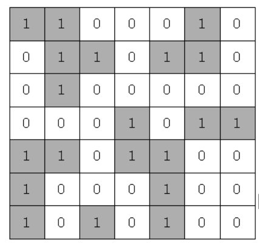

# 섬나라 아일랜드

### 구분

DFS

### 설명

N*N의 섬나라 아일랜드의 지도가 격자판의 정보로 주어집니다.

각 섬은 1로 표시되어 상하좌우와 대각선으로 연결되어 있으며, 0은 바다입니다.

섬나라 아일랜드에 몇 개의 섬이 있는지 구하는 프로그램을 작성하세요.

만약 위와 같다면 섬의 개수는 5개입니다.

### 입력

첫 번째 줄에 자연수 N(3<=N<=20)이 주어집니다.

두 번째 줄부터 격자판 정보가 주어진다.

### 출력

첫 번째 줄에 섬의 개수를 출력한다.

### 예시 입력 1

<pre>7
1 1 0 0 0 1 0
0 1 1 0 1 1 0
0 1 0 0 0 0 0
0 0 0 1 0 1 1
1 1 0 1 1 0 0
1 0 0 0 1 0 0
1 0 1 0 1 0 0</pre>

### 예시 출력 1

<pre>5</pre>