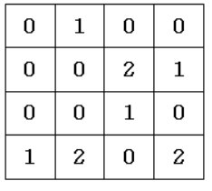

# 피자 배달 거리

### 구분

DFS

### 설명

N×N 크기의 도시지도가 있습니다. 도시지도는 1×1크기의 격자칸으로 이루어져 있습니다.

각 격자칸에는 0은 빈칸, 1은 집, 2는 피자집으로 표현됩니다. 각 격자칸은 좌표(행번호, 열 번호)로 표현됩니다.

행번호는 1번부터 N번까지이고, 열 번호도 1부터 N까지입니다.

도시에는 각 집마다 “피자배달거리”가 았는데 각 집의 피자배달거리는 해당 집과 도시의 존재하는

피자집들과의 거리 중 최소값을 해당 집의 “피자배달거리”라고 한다.

집과 피자집의 피자배달거리는 |x1-x2|+|y1-y2| 이다.

예를 들어, 도시의 지도가 아래와 같다면

(1, 2)에 있는 집과 (2, 3)에 있는 피자집과의 피자 배달 거리는 |1-2| + |2-3| = 2가 된다.

최근 도시가 불경기에 접어들어 우후죽순 생겼던 피자집들이 파산하고 있습니다.

도시 시장은 도시에 있는 피자집 중 M개만 살리고 나머지는 보조금을 주고 폐업시키려고 합니다.

시장은 살리고자 하는 피자집 M개를 선택하는 기준으로 도시의 피자배달거리가 최소가 되는 M개의 피자집을 선택하려고 합니다.

도시의 피자 배달 거리는 각 집들의 피자 배달 거리를 합한 것을 말합니다.

### 입력

첫째 줄에 N(2 ≤ N ≤ 50)과 M(1 ≤ M ≤ 12)이 주어진다.

둘째 줄부터 도시 정보가 입력된다.

### 출력

첫째 줄에 M개의 피자집이 선택되었을 때 도시의 최소 피자배달거리를 출력한다.

### 예시 입력 1

<pre>4 4
0 1 2 0
1 0 2 1
0 2 1 2
2 0 1 2</pre>

### 예시 출력 1

<pre>6</pre>