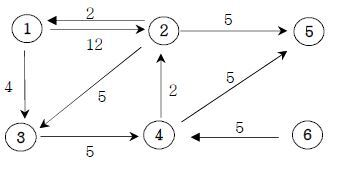

# 다익스트라 알고리즘

### 구분

Greedy Algorithm

### 설명

아래의 가중치 방향그래프에서 1번 정점에서 모든 정점으로의 최소 거리비용을 출력하는 프로
그램을 작성하세요. (경로가 없으면 Impossible를 출력한다)

### 입력

첫째 줄에는 정점의 수 N(1<=N<=20)와 간선의 수 M가 주어진다. 그 다음부터 M줄에 걸쳐 연
결정보와 거리비용이 주어진다.

### 출력

1번 정점에서 각 정점으로 가는 최소비용을 2번 정점부터 차례대로 출력하세요.

### 예시 입력 1

<pre>6 9
1 2 12
1 3 4
2 1 2
2 3 5
2 5 5
3 4 5
4 2 2
4 5 5
6 4 5</pre>

### 예시 출력 1

<pre>2 : 11
3 : 4
4 : 9
5 : 14
6 : impossible</pre>